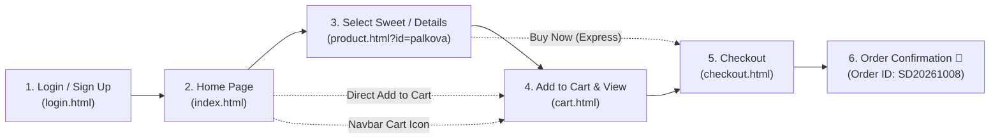

# 🍬 Sweet Delight — Artisanal Indian Mithai & Confectionery

> **“A Little Sweetness in Every Bite”**

A modern, responsive, frontend-only Indian sweet shop web application crafted with **HTML5, CSS3, and JavaScript (ES6+)**. Built with an imperial royal aesthetic inspired by traditional Indian sweet boutiques—featuring deep royal maroon, warm gold accents, pure ivory cream, and soft saffron highlights.

---

## 🌟 Live Demo & How to Run

No build step, Node.js server, or external database required! You can open the project directly in any modern browser:

1. **Direct Browser**:
   - Double-click [`index.html`](file:///c:/Users/muthu/OneDrive/文档/Akash/index.html) or [`login.html`](file:///c:/Users/muthu/OneDrive/文档/Akash/login.html) to open directly in Chrome, Edge, Firefox, or Safari.
2. **Local HTTP Server** (Optional):
   ```bash
   # Using Python 3
   python -m http.server 8080

   # Or using Node npx serve
   npx serve .
   ```
   Then open `http://localhost:8080/` in your browser.

---

## 🗂️ Project Structure

```
Akash/
├── index.html               # Home page with hero banner, categories, product grid
├── home.html                # Home page mirror / instant redirect
├── login.html               # Welcome auth page with login, sign-up & demo validation
├── product.html             # Detailed Sweet page with weights, price calculations & Buy Now
├── cart.html                # Shopping cart with quantity, promo discounts & empty state
├── checkout.html            # Checkout form (COD, UPI, Card) & order confirmation screen
├── README.md                # Project documentation & walkthrough
├── data/
│   └── sweets.js            # Sweet catalog dataset, categories & weight pricing config
├── styles/
│   └── main.css             # Luxury royal theme, animations, toast alerts & responsive layout
├── scripts/
│   ├── app.js               # Core engine: Cart, Auth, Search, Wishlist, Toasts & LocalStorage
│   ├── generate_svgs.js     # Generator script for handcrafted vector sweet illustrations
│   ├── test_pages.js        # Automated script to validate all inline HTML scripts
│   └── verify_links.py      # Automated asset, link, and image integrity verification script
└── assets/
    └── images/
        ├── logo.svg         # Royal Sweet Delight emblem with Diya motif
        ├── placeholder.svg  # Fallback vector artwork for any sweet
        └── sweets/          # 12 handcrafted vector sweet illustrations:
            ├── gulab-jamun.svg
            ├── mysore-pak.svg
            ├── palkova.svg
            ├── kaju-katli.svg
            ├── laddu.svg
            ├── rasgulla.svg
            ├── badam-halwa.svg
            ├── jangiri.svg
            ├── kesar-peda.svg
            ├── anjeer-barfi.svg
            ├── rasmalai-cake.svg
            └── royal-gift-box.svg
```

---

## 🧭 Complete User Navigation Flow

The application implements the complete guided flow requested:



### Alternate Direct Pathways Supported:
- **Home → Add to Cart → Cart** (Quick add directly from cards on Home page)
- **Home → Cart icon → Cart** (Persistent sticky navbar with live item counter badge)
- **Product Details → Buy Now → Checkout** (Express 1-click purchase)

---

## 📋 Detailed Page Walkthrough

### 1. Login / Sign Up Page (`login.html`)
- **Branding**: Royal Diya emblem logo, tagline *“A Little Sweetness in Every Bite”*.
- **Login Tab**: Email, password input, show/hide password toggle (👁️ / 🔒), validation.
- **Sign Up Tab**: Full Name, Email, Password, and Confirm Password with matching check.
- **Demo Helper**: One-click demo login button for **Akash Sharma** (`akash@sweetdelight.com`).
- **Continue as Guest**: Allows frictionless browsing without immediate authentication.
- **Persistence**: Login state stored in browser `localStorage`.

### 2. Home Page (`index.html`)
- **Sticky Navbar**:
  - Royal emblem & brand logo.
  - Links: Home, Sweets, Categories, About, Contact.
  - Live search input with instant autocomplete dropdown.
  - Wishlist button with live count.
  - Cart button with dynamic item count badge.
  - User status pill: shows avatar & user name when signed in with logout menu.
- **Hero Section**:
  - Headline: **“Taste the Tradition”** with shimmering gold gradient.
  - Subtitle: *“Freshly prepared traditional sweets made with love.”*
  - CTA Buttons: **Shop Sweets** and **Explore Collection**.
  - Floating badges for rating (4.9/5) and royal specials.
- **Categories (Interactive Filter Cards)**:
  - 🪔 Traditional Sweets
  - 🥛 Milk Sweets
  - 🥜 Dry Fruit Sweets
  - 🎉 Festival Specials
  - 🍰 Cakes & Desserts
  - 🎁 Gift Boxes
  - Clicking any category instantly filters the popular sweets catalog!
- **Popular Sweets Catalog**:
  - Includes all 8 mandatory sweets plus festive curations:
    1. **Gulab Jamun** – ₹180 / 500g
    2. **Mysore Pak** – ₹250 / 500g
    3. **Palkova** – ₹300 / 500g *(Special highlight: thick, creamy milk-based sweet)*
    4. **Kaju Katli** – ₹450 / 500g
    5. **Laddu** – ₹220 / 500g
    6. **Rasgulla** – ₹200 / 500g
    7. **Badam Halwa** – ₹350 / 500g
    8. **Jangiri** – ₹200 / 500g
    9. *Kesar Peda* – ₹280 / 500g
    10. *Anjeer Dry Fruit Barfi* – ₹520 / 500g
    11. *Rasmalai Dessert Jar* – ₹320 / 500g
    12. *Royal Heritage Mithai Box* – ₹850 / 1kg
  - Every card features:
    - Best Seller / New / Festive badges
    - Wishlist heart toggle
    - Star ratings & review counts
    - Quantity selector (`-` / `+`)
    - **Add to Cart** button (triggers toast alert)
    - **View Details** button (navigates to product page)
- **Brand Story & Features**:
  - 40+ years heritage story since 1984.
  - 100% Pure Desi Ghee promise, Farm Fresh Cow Milk, No Preservatives, Aroma-Lock Packing.
- **Contact & Newsletter**:
  - Boutique locator (Delhi & Bengaluru).
  - Working inquiry form & newsletter subscription with coupon reward.
- **Floating Controls**:
  - Mobile sticky cart pill with item count & total.
  - Smooth back-to-top floating button.

### 3. Sweet Details Page (`product.html`)
- Displays detailed view for any sweet using query parameter (e.g. `product.html?id=palkova`).
- Large product illustration with zoom hover effect and packaging thumbnail selector.
- **Weight Selection Options**:
  - **250g** (Half portion, multiplier 0.55)
  - **500g** (Standard portion, multiplier 1.0)
  - **1kg** (Family pack, multiplier 1.9 with 5% discount)
  - Price updates in real time on the screen as the user switches weight!
- Quantity selector (`-` and `+`).
- **Add to Cart** button: adds selected weight + quantity and fires toast: **“Palkova added to your cart!”**.
- **Buy Now** button: adds to cart and proceeds directly to checkout!
- Full ingredient list, shelf life, and nutritional breakdown.
- Related sweets recommendations grid.

### 4. Shopping Cart Page (`cart.html`)
- **Line Items**: Product thumbnail, name, selected weight (e.g. 250g / 500g / 1kg), unit price, quantity increment/decrement, remove item button, line subtotal.
- **Calculations**:
  - Items Subtotal.
  - Delivery Fee: **FREE** for orders ₹500 and above (else ₹50).
  - Free delivery progress banner (*"Add ₹X more for FREE delivery!"*).
- **Promo Coupons**:
  - `SWEET10`: 10% Welcome Discount.
  - `FESTIVE50`: ₹50 Festive Special discount.
- **Empty State**:
  - When all items are removed: Displays **“Your cart is empty 🍬”** with a **Start Shopping** button.
- Cart items persist across browser page reloads via `localStorage`.

### 5. Checkout & Confirmation Page (`checkout.html`)
- **Customer Details Form**:
  - Full Name (auto-filled if logged in)
  - Mobile Number (10-digit validation)
  - Email (format validation)
  - Delivery Address (Street address)
  - City & Pincode (6-digit validation)
- **Payment Modes**:
  - 💵 **Cash on Delivery (COD)** (Default recommended)
  - 📱 **UPI** (Google Pay, PhonePe, Paytm with custom UPI ID & QR code preview)
  - 💳 **Credit / Debit Card** (Card number, Expiry, CVV inputs)
- **Order Summary Sidebar**:
  - Miniature product thumbnails, portions, subtotals, and final payable amount.
- **Order Confirmation**:
  - Upon clicking **Place Order**, cart is finalized and cleared.
  - Displays: **“Order Placed Successfully! 🎉”**
  - Displays Order ID: **`SD20261008`**
  - Displays: **“Thank you for shopping with Sweet Delight.”**
  - Full receipt breakdown with estimated delivery time (*"Tomorrow by 2:00 PM"*).
  - Action buttons: **View Home**, **Continue Shopping**, and **Print Receipt**.

---

## 🎨 Design & Palette System

| Element | Color Hex | Description |
|---|---|---|
| Background Cream | `#FCFAF6` / `#FFFDF9` | Warm, luxurious ivory canvas |
| Royal Maroon | `#6B0F24` / `#5C0B1D` | Heritage imperial Indian burgundy |
| Imperial Gold | `#D4AF37` / `#FFE082` | Regal accents, buttons, and borders |
| Warm Saffron | `#C2410C` / `#EA580C` | Traditional celebratory highlights |
| Forest Green | `#10B981` | Success alerts, vegetarian badges |

---

## 🧪 Testing & Verification Results

1. **HTML & Inline Scripts Syntax**:
   - `node scripts/test_pages.js` → **100% Valid (All 5 HTML pages and inline scripts passed)**
2. **Asset Integrity & Links**:
   - `python scripts/verify_links.py` → **100% Passed (83 internal links & SVG assets verified)**
3. **HTTP Server Integration**:
   - `python scripts/test_http_server.py` → **All 14 endpoints served with HTTP 200 OK**
4. **Console Errors**: **0 Errors across all pages**.
